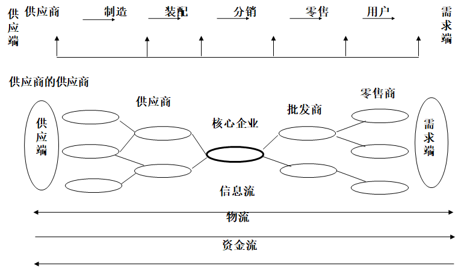

# 供应链管理

**平时成绩：** 30%

**期末成绩：** 70%

## 名词解释

- **供应链**：供应链是围绕核心企业，通过对信息流、物流、资金流的控制，从采购原料开始，制成中间产品（零部件）以及最终产品，最后由销售网络把产品送到消费者手中的将供应商、制造商、分销商、零售商、物流服务商，直到最终用户连成一个整体的功能网链结构。
- **供应链管理**：供应链管理就是使以核心企业为中心的供应链运作达到最优化，以最少的成本，让供应链从采购开始，到满足最终顾客的所有过程，包括尚流、实物流、资金流和信息流等均能高效率地操作，把合适的产品、以合理的价格，及时、准确地送到消费者手上。
- **横向一体化**：横向一体化即利用企业外部资源快速响应市场需求，本企业只抓自己具有核心竞争力的业务，将非核心业务交由其他企业完成，实施业务外包，以最大限度取得竞争优势的管理方式。
- **长鞭现象**：长鞭效应即需求变异方大现象，是对需求信息在供应链传递中被扭曲的现象的一种形象描述。其基本含义是：当供应链的各节点企业只根据来自其相邻的下级企业的需求信息做出生产或供给决策时，被扭曲了的需求信息会沿着供应链从市场端传递到供应端，使订货量逐级放大，到达源头供应商时，其获得的需求信息和实际消费市场中的顾客需求信息发生了很大的偏差，需求变异将实际需求量放大了。
- **供应契约**：供应契约是指通过合理设计供应链合作双方的契约,减少合作双方的机会主义行为，促进企业之间的紧密合作，确保有效完成订单交付，保证产品质量，提高用户满意度,降低供应链成本，提高整条供应链的绩效及每一个成员企业的绩效。
- **CPFR**： 合作计划、预测和补货(CPFR)是一种供应链计划与运作管理的新的哲理，它应用一系列的处理和技术模型，提供覆盖整个供应链的合作过程,通过共同管理业务过程和共享信息来改善零售商和供应商的伙伴关系，提高预测的准确度，最终达到提高供应链效率、减少库存和提高消费者满意程度的目的。
- **JIT**：准时制生产（JIT）生产方式,国内也有人译为无库存生产方式或称为丰田制造体系。是一种综合管理技术，一种新的管理哲理。JIT 的基本思想就是要求严格按用户需求生产产品，缩短生产周期，压缩在制品占用量，提高效率，降低成本。
- **QR**： QR是指在供应链中，为了实现*共同的目标*，零售商和制造商建立战略伙伴关系，利用EDI等信息技术，进行销售时点的信息交换以及订货补充等其他经营信息的交换，用多频度小数量配送方式连续补充商品，以实现缩短交货周期，减少库存，提高客户服务水平和企业竞争力的供应链管理方法。
- **3PL**： 第三方物流系统(3PL)是种实现供应链集成的有效方法和策略,它通过协调企业之间的物流运输和提供后勤服务，把企业的物流业务外包给专门的物流管理部门。特别是一些特殊的物流运输业务，通过外包给第三方物流承包者，企业能够把时间和精力放在自己的核心业务上，提高了供应链管理和运作的效率。
- **VMI**： 供应商管理库存（VMI）是一种供应链集成化运作的库存管理模式，是一种用户和供应商之间的合作性策略，以对双方来说都是最低的成本增加产品的可获性，在一个相互同意的目标框架下由供应商管理库存,这样的目标框架被经常性地监督和修正，以产生一种连续改进的环境。
- **JMI**： 联合库存管理(JMI)是解决供应链系统中由于各节点企业的相互独立库存运做模式导致的需求放大现象，提高供应链的同步化程度的一种有效方法。

### 供应链的结构模型

## 简答

