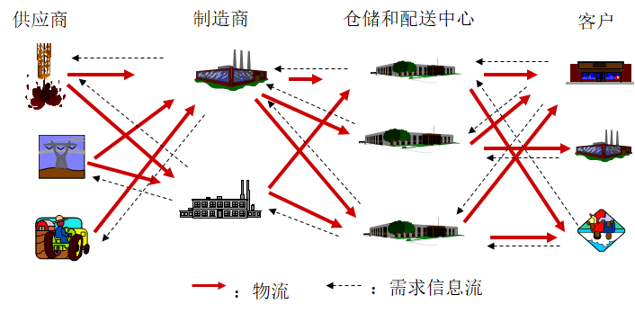
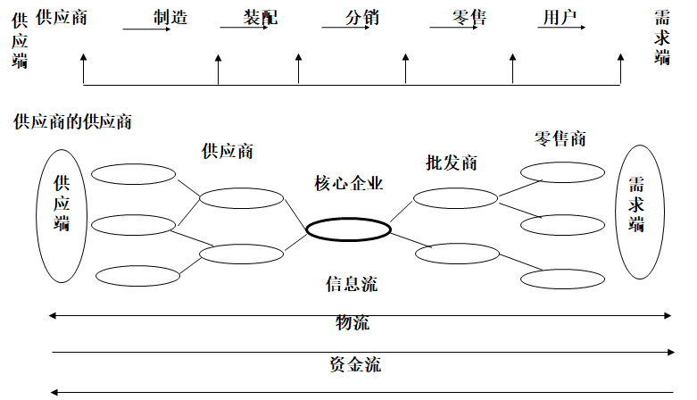
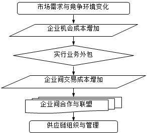
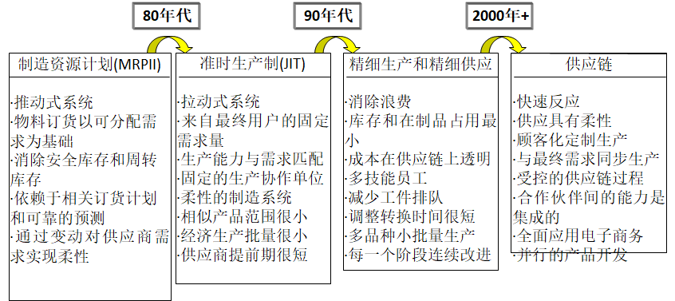
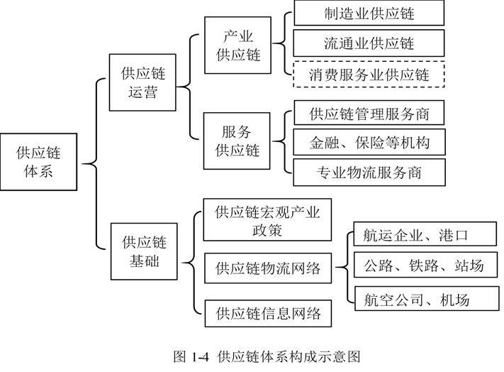
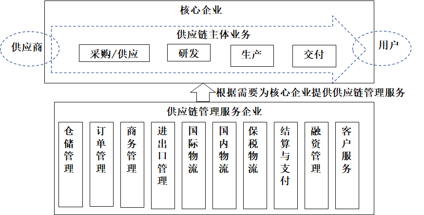

# 供应链管理

供应链管理A课堂笔记

**目录 (Table of Contents)**

[TOC]

### 成绩介绍

#### **成绩计算**

- **平时成绩：** 30%

考勤：共20次课，旷课一次扣20分。

平时作业：

（1）思维导图，每个小组选2～3个章节做思维导图。

（2）出题，每个章节结束后，每个小组进行出题。

（3）2次大作业。

加分：供应链案例分享

- **期末成绩：** 70%

#### **如何学习**

1. 老师上课
2. 大量的课外书籍阅读
3. 网络资源

### 供应链是什么

#### **供应链到底是什么？**

举例：包子铺

- **供应链的概念**

  

   供应链是围绕核心企业，通过对信息流、物流、资金流的控制，从采购原材料开始，制成中间产品以及最终产品，最后由销售网络把产品送到消费者手中的将供应商、制造商、分销商、零售商、直到最终用户连成一个整体的功能网链结构。

  

  **国务院办公厅《关于积极推进供应链创新与应用的指导意见》：**

  供应链是以客户需求为导向、以提高质量和效率为目标，以整合资源为手段，实现产品设计、采购、生产、销售、服务等全过程高效协同的组织形态。

  

  **本书的定义：**

  供应链是围绕核心企业，通过对信息流、物流、资金流的控制，从采购原材料开始，制成中间产品（零部件）以及最终产品，最后通过销售网络把产品送到消费者手中的将供应商、制造商、分销商、零售商直到最终用户连成一个整体的功能网链结构。

### 横向一体化和纵向一体化

#### **供应链的结构模型**

​	最大的变化：由纵向变成了横向

​	类似案例：淘宝商、企业外包业务。

#### 供应链管理思想的萌芽

- **“纵向一体化”到“横向一体化”**
  -  横向一体化”形成了一条从供应商到制造商再到分销商、零售商的贯穿所有企业的“链”
  - 相邻节点企业表现出一种需求与供应的关系，当把所有相邻企业依此连接起来，便形成了供应链(Supply Chain)
  - 供应链管理(Supply Chain Management, SCM) 使链上的节点企业必须达到同步、协调运行
- 供应链管理的概念是把企业资源的范畴从过去单个企业扩大到整个社会，使企业之间为了共同的市场利益而结成战略联盟

#### **新的竞争环境对企业管理模式的影响**

- 以“纵向一体化”(vertical integration)为主导的传统管理模式

- “纵向一体化”管理模式的主要弊端

- 管理模式的发展

  

- **以“纵向一体化”(vertical integration)为主导的传统管理模式**

  - 管理模式是一种系统化的指导与控制方法，它把企业中的人、财、物和信息等资源，高质量、低成本、快速及时地转换为市场所需要的产品和服务。

  - 企业运营管理的三个核心：质量、成本、时间

  - 传统管理模式
    - 纵向一体化（大而全、小而全）
    - 生产计划与控制：MRP、MRPII、JIT、LP……
    - 竞争因素转移：
      - 价格（大量生产 ）
      - 质量（TQM）
      - 时间（TBC）

- **“纵向一体化”管理模式的主要弊端**

  - *增加企业投资负担

  - 承担丧失市场时机的风险

  - 迫使企业从事不擅长的业务活动

  - 在每个业务领域都直接面临众多竞争对手

  - 增大企业的行业风险**

    

### 课堂总结

1. 什么是供应链管理
2. 什么是纵向一体化
3. 什么是横向一体化

- **21世纪全球市场竞争的主要特点**
  1. **产品寿命周期越来越短**
     - 国外新产品的研制周期大大缩短
     - 产品的生命周期缩短，革新换代速度加快
  2. **对订单的响应速度要求越来越高**
     - 企业竞争力的五大要素：品种、质量、价格、时间、服务
  3. **企业运营的驱动方式产生了根本变化——从M2C到C2M**
  4. **对产品和服务的期望越来越高**
     - “一对一”的定制化产品和服务
     - 企业管理的复杂性
  5. **保护环境与可持续发展的要求**

### 供应链产生的必然性

- 21世纪面临的市场空间和形态的变化

- 传统管理模式的主要特征及其在新环境下的不适应性

- 传统管理模式的主要特点是“纵向一体化”

- 交易成本变动形成的无限动力

  

**供应链组织的产生原理图：**

#### 供应链管理思想的萌芽

- **“纵向一体化”到“横向一体化”**
  - 横向一体化”形成了一条从供应商到制造商再到分销商、零售商的贯穿所有企业的“链”
  - 相邻节点企业表现出一种需求与供应的关系，当把所有相邻企业依此连接起来，便形成了供应链(Supply Chain)
  - 供应链管理(Supply Chain Management, SCM)使链上的节点企业必须达到同步、协调运行
- 供应链管理的概念是把企业资源的范畴从过去单个企业扩大到整个社会，使企业之间为了共同的市场利益而结成战略联盟
- 21世纪的竞争不是企业和企业之间的竞争，而是供应链与供应链之间的竞争。

 **建立在最佳生产系统平台上的供应链：**

#### 供应链管理的概念

- **国外关于供应链管理的不同的定义和称呼**
- **供应链管理是一种集成的管理思想和方法**
- **供应链管理**，就是使以核心企业为中心的供应链运作达到最优化，以最少的成本，令供应链从采购开始，到满足最终顾客的所有过程，包括工作流（work flow）、实物流（physical flow）、资金流（funds flow）和信息流（information flow）等均高效率地操作，把合适的产品、以合理的价格，及时准确地送到消费者手上

### 供应链诞生的背景

#### 供应链管理的核心理念

- **整合理念**（Integration）

- **合作理念**(Cooperation) 

- **协调理念**(Coordination) 

- **分享理念**(Benefit-Sharing) 

##### 整合思维

——供应链管理上升到整合思维层次。在这一思维范式里，强调从供应链整体最优寻求企业内外的最佳资源配置

- - 信息整合（苹果与富士康库存数据）

- - 协调与资源共享（VMI模式）

- - 组织互联

##### 合作思维

- 供应链管理是由“横向一体化”发展而来的，因此在供应链管理的实践中非常强调合作伙伴之间的合作。

- 只有实现了合作伙伴之间的真诚的、战略性的合作，才能共同实现供应链的整体利益最大化。供应链管理的对象一个企业群，其中的每一个企业都有各自的核心业务和核心能力，如何才能将这些企业的能力整合在一起，形成真正的合力，是关系到能否实现供应链整体目标的关键、

  案例：医院之间的合同，上级医院与下级医院。富士康与苹果

##### 协调思维

- 供应链管理涉及若干个企业在运营中的管理活动，为了实现供应链管理的目标，要求相关企业在运营活动中必须按照计划协调运作，不能各自为政。
- 协调运作就是打破传统上的企业各自为政的分散决策方式，通过协调契约的设计，能使合作双方都能够增加收益，同时达到供应链整体利益最大化的目标

##### 分享思维

- 是否具有供应链管理的核心理念——收益共享，是保证合作伙伴能否真心实意地与核心企业站在一个阵营内的重要条件。

- 合作企业之所以愿意在一个供应链体系内共创价值，是因为它们看到这个供应链能够创造更多的收益，但是这些收益必须实行共享，才有可能将供应链的资源整合起来。

#### 供应链管理模式双向发展趋势 ——宏观战略层和行业细分发展
- **对供应链体系的再认识**

- **供应链体系构成示意图**
- **供应链——国家竞争力视角**
- **供应链管理向行业细分发展**

- **供应链体系构成示意图**

  

- **供应链管理服务的业务模式**

### 课堂总结

1. 供应链产生的必然性
2. 供应链的核心思想

### 供应链竞争力

#### 影响供应链竞争力的资源属性

- **供应链管理模式在资源应用的模式上不同于传统的管理模式，进而形成了自己独特的竞争力。**
- 

### 供应链系统模型

### 供应链管理体系的组成

