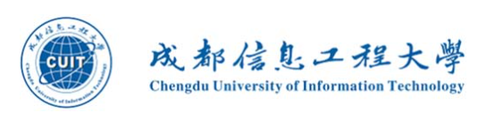

# 成都信息工程大学课程资料仓库

**目前仅作为个人课程资料备份，欢新增资源、完善资源、提出改进意见等** :heart:

## [课程资料目录](./docs/)

 本仓库的资源默认采用<a rel="license" href="http://creativecommons.org/licenses/by-nc-sa/4.0/deed.zh">知识共享署名-非商业性使用-相同方式共享 4.0 国际许可协议</a>进行许可，有特别说明的除外。这意味着您可以对本仓库中所包含的资源进行复制、发行、修改和创作等，但不得用于商业性目的，在使用时须进行署名，且以相同或兼容的协议进行许可。仓库的资源来自于用户和互联网，其正确性不做保证。

